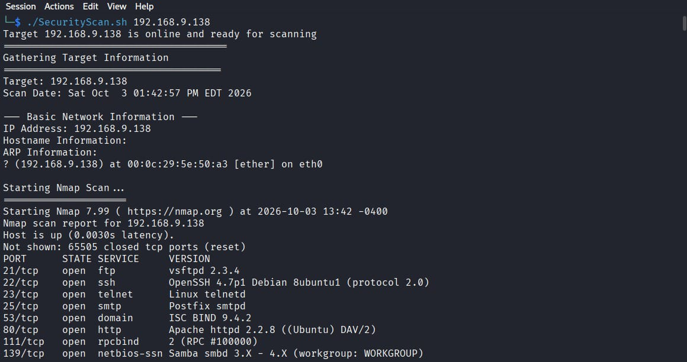

# SecScan — Automated Security Assessment Tool

SecScan is a Bash-based automated security assessment tool designed to automate network reconnaissance, service enumeration, service-specific security checks, credential auditing, and HTML security reporting.

## Features

* Host reachability check
* Full-port Nmap scanning with service and version detection
* Open port and service parsing
* FTP anonymous access testing
* SSH and Telnet banner collection
* SMTP user enumeration using `smtp-user-enum`
* Credential auditing using Hydra
* DNS information gathering through SOA queries
* HTTP security checks and common path discovery
* SMB anonymous share enumeration
* Automated security findings collection
* HTML Security Assessment Report generation

## Project Workflow

```text
Target IP
    ↓
Reachability Check
    ↓
Nmap Full-Port Scan
    ↓
Open Port & Service Parsing
    ↓
Service-Specific Security Checks
    ↓
Security Findings & Credential Audit
    ↓
Report Generation
    ↓
HTML Security Assessment Report
```

## Technologies & Tools

* Bash
* Linux
* Nmap
* Hydra
* smtp-user-enum
* cURL
* HTML

## How It Works

The tool starts by taking a target IP address and checking whether the host is reachable.

It then performs a full-port Nmap scan with service and version detection.

Based on the identified services, SecScan performs different security checks.

### FTP

* Tests for anonymous access
* Attempts to retrieve available file listings

### SSH / Telnet

* Collects service banners
* Identifies Telnet exposure

### SMTP

* Enumerates usernames using `smtp-user-enum`
* Uses discovered usernames for credential auditing with Hydra against supported services

### DNS

* Performs DNS information gathering through SOA queries

### HTTP

* Checks HTTP security-related information
* Tests common paths
* Checks for directory listing
* Detects exposed `phpinfo`
* Identifies potentially sensitive server information

### SMB

* Tests anonymous access
* Enumerates available shares
* Checks accessible share contents

## Installation & Usage

Clone the repository:

```bash
git clone https://github.com/YOUR-USERNAME/secscan-automated-security-assessment.git
cd secscan-automated-security-assessment
```

Make the script executable:

```bash
chmod +x SecurityScan.sh
```

Run the tool:

```bash
./SecurityScan.sh <target-ip>
```

Example:

```bash
./SecurityScan.sh 192.168.9.138
```

## Reporting

After the assessment is completed, SecScan generates structured security assessment data and an HTML report containing:

* Target information
* Scan information
* Open ports and services
* Service-specific findings
* Security observations
* Risk information
* Recommendations
* Credential-audit results

Sensitive credential values should be masked or excluded when sharing assessment results publicly.

## Screenshots

### 1. Terminal & Nmap Scan



### 2. SMTP User Enumeration


### 3. Hydra Credential Auditing


### 4. SMB Enumeration


### 5. SMB Anonymous Access


### 6. Security Assessment Report


### 7. Credential Audit Results


## Learning Outcomes

Building SecScan helped strengthen practical skills in:

* Network reconnaissance
* Service enumeration
* Security assessment automation
* Bash scripting
* Authentication and credential auditing
* Web and network security testing
* Security reporting

## Disclaimer

This tool is intended for authorized security testing and educational lab environments only.

Do not use SecScan against systems without explicit permission.
